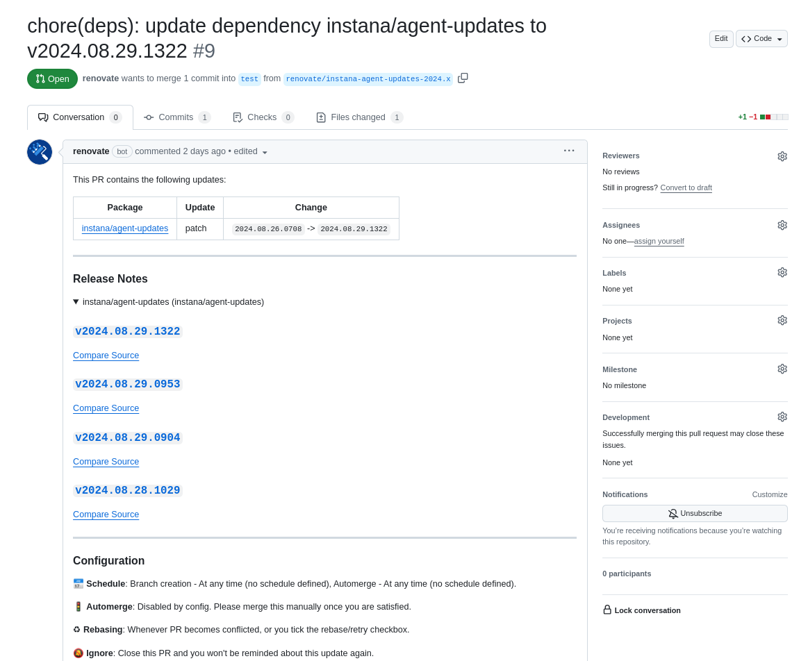
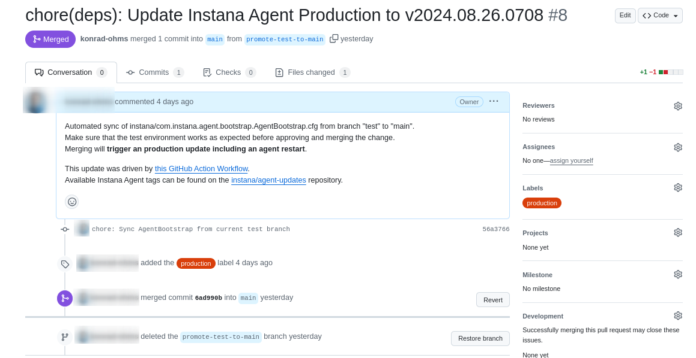

# Sample repository for Instana Git-based configuration management

This repository provides samples of how to configure your Git or GitHub repository to make use of the Git-based Configuration Management capabilities of the Instana host agent.

## Repository structure

The Git repository you use to store configurations for the Instana host agent should have the same structure as the host agent's `<agent_installation_dir>/etc` folder.
In the large majority of cases, you will likely need to version only files in the `instana/` subfolder, although some settings like repository configurations for advanced update management scenarios will require you to modify files like `mvn-settings.xml` in the root of the repository.

Only the files you version will override existing configurations present in the agent, so feel free to version the minimal amount of configurations you need.
(At Instana we work really hard to ensure you need to configure anyhow as little as possible :-) .)

## Git Hooks

The [.githooks/post-receive](.githooks/post-receive) file provides you a sample of how to configure your Git repository so that, when a branch is updated, it will notify the Instana backend that some Git-enabled agents should update their configurations.

## GitHub Action

The [.github/workflows/instana-gitops-update.yml](.github/workflows/instana-gitops-update.yml) file shows you how to wire the Instana GitHub action for GitOps as a GitHub Workflow, to be executed when a branch is updated.

## Further reading

* [Instana's Git-based Configuration Management documentation](https://www.instana.com/docs/setup_and_manage/host_agent/configuration/git_ops#with-the-api)
* [Instana GitHub action for GitOps](https://github.com/instana/github-action-update-agent-configurations)
* [Githooks documentation](https://git-scm.com/docs/githooks)


## Quickstart

### Preparing the repository

Fork this repository to get started or copy files as desired to a new git repository.

Change files in the [instana](./instana) folder to match the new target environment. Ensure to change files on branches `main` for production and on branch `test` for the test environment.

To be able to run the GitHub Actions Workflows, define credentials for the Instana backend and a GitHub personal access token.

To generate an Instana backend token, login into the Instana UI and navigate to `Settings > Team Settings > API Tokens > New API Token` and select the `Configuration of agents` permission and `Save`.


The GitHub workflow which promotes changes from the `test` branch to `main` requires access to the GitHub repository via GitHub Personal Access Token which can be generated in GitHub's Developer Settings > [New personal access token (classic)](https://github.com/settings/tokens/new).
The access token requires permission on the forked repository and the following repository permissions:

- repo > public repo

If the repository is not public, permission to access a private repository is also required.

In the GitHub settings of the gitops repository navigate to `Secrets and variables > Actions` and define the following entries as repository secrets:

- `GH_TOKEN`: Personal access token for the GitHub API
- `INSTANA_API_ENDPOINT`: URL used for the Instana login, e.g.: https://qa-instana.instana.io
- `INSTANA_API_TOKEN`: API token for the Instana API

To receive updates via renovate, install the [Renovate GitHub App](https://github.com/apps/renovate) on this repository.

### Installing the agents

Installing and configuring new agents to pull updates from this repository can be performed during installation or by changing configuration of existing agents.

By defining `main` as branch name new agents will be onboarded with production configuration, choosing `test` will apply the configuration of the test branch from this repository.

**Linux Host agents via One-Line-Installer**:

```#!/bin/bash
curl -o setup_agent.sh https://setup.instana.io/agent && chmod 700 ./setup_agent.sh && sudo ./setup_agent.sh \
    -a xxx \
    -d xxx \
    -t dynamic \
    -e ingress-red-saas.instana.io:443 \
    -s \
    -g https://github.com/instana/gitops-demo.git \
    -b test
```

**Docker based installation**

```#!/bin/bash
docker run \
   --detach \
   --name instana-agent \
   --volume /var/run:/var/run \
   --volume /run:/run \
   --volume /dev:/dev:ro \
   --volume /sys:/sys:ro \
   --volume /var/log:/var/log:ro \
   --privileged \
   --net=host \
   --pid=host \
   --env="INSTANA_AGENT_ENDPOINT=ingress-red-saas.instana.io" \
   --env="INSTANA_AGENT_ENDPOINT_PORT=443" \
   --env="INSTANA_AGENT_KEY=xxx" \
   --env="INSTANA_DOWNLOAD_KEY=xxx" \
   --env="INSTANA_GIT_REMOTE_BRANCH=test" \
   --env="INSTANA_GIT_REMOTE_REPOSITORY=https://github.com/instana/gitops-demo.git" \
   icr.io/instana/agent
```

**Manual mode**

Export the environment variables `INSTANA_GIT_REMOTE_BRANCH`, `INSTANA_GIT_REMOTE_REPOSITORY` and optional credentials (`INSTANA_GIT_REMOTE_USERNAME`, `INSTANA_GIT_REMOTE_PASSWORD`) in case of a private repository to the instana agent process. This can e.g. be achieved via systemd, see also the [Instana Documentation](https://www.ibm.com/docs/en/instana-observability/current?topic=agents-git-based-configuration-management) for more details.

The examples above onboard a new agent to the test environment, if the agent should join the production group, define `main` instead of `test` as `INSTANA_GIT_REMOTE_REPOSITORY`.

**Configuring Git-based configuration management on existing agents**

An existing host agent can be configured to pull changes from a git repository. Navigate into the Instana UI and open the Agent Dashboard. Click on the `Initialize` button shown in the `Configuration Management` section. After entering the details and clicking on `Initialize & Restart` the configuration will be loaded and applied.


Note: After applying new agent versions, it can take up to a few minutes before the new version is shown correctly in the Agent Dashboard view, as values are cached.

## Update Workflow

This project uses [renovate](https://github.com/apps/renovate) to automatically watch the [instana/agent-updates](https://github.com/instana/agent-updates/tags) repositories for new tags and to create a pull request (PR) against the `test` branch.



Once the PR was reviewed and merged, GitHub Actions will run a workflow to send an update request to the configured Instana backend. 
A second workflow is triggered to open a PR with changes from the `test` branch against the `main` branch.



This is meant to be a quality gate which provides an option for customers to validate a new agent version in their given environment before pushing it out to production. When the new agent version is validated the PR against `main` can be merged and the update gets promoted by a GitHub Actions workflow which notifies the Instana backend to send update requests to the selected agent groups.

In the given example, it is assumed that all systems in the test or production group will receive updates at once. If a staged rollout is desired, more detailed tags can be defined or more branches can be used so that update requests could be send in batches via additional steps in the GitHub Actions workflow.

The intial update PRs against the `test` branch are raised by [renovate](https://github.com/renovatebot/renovate). It is parsing the comment defined in [instana-gitops-update.yml](.github/workflows/instana-gitops-update.yml) to detect where to search for new instana agent tags in GitHub:

```
# renovate: datasource=github-tags depName=instana/agent-updates versioning=loose
version = 2024.08.20.0843
```

The [renovate configuration](./renovate.json) defines a regular expression to match the version number and to replace it with the new tags on a feature branch. The feature branch is used in a PR against the `test` branch. Renovate will always check the `renovate.json` found on the main branch, but it can define base branches to update (in this example, it only proposes updates to branch `test`). For more details see the [renovate documentation](https://docs.renovatebot.com/modules/manager/regex/).

GitHub Actions will use the workflow definitions of the branch which currently triggered the action. A push to the `test` branch will therefore trigger the GitHub workflow store in the `test` branch rather than the definition stored in `main`.

## Usage of different tooling

This repository uses GitHub Actions to send agent update requests to the Instana Backend and uses a reusable GitHub Action for that purpuse. If other CI tools like Jenkins or Tekton should be used, any HTTP client can be leveraged to send a request, see the usage of `curl` in the [GitHub Action definition](https://github.com/instana/github-action-update-agent-configurations/blob/master/entrypoint.sh) for more details.

To get automatic update notifications, renovate was used in this example. Renovate can be installed as GitHub app, but it can be self-hosted on own infrastructure if prefered.
If renovate should not be used at all, tags can be updates manually or by running scripts periodically.
